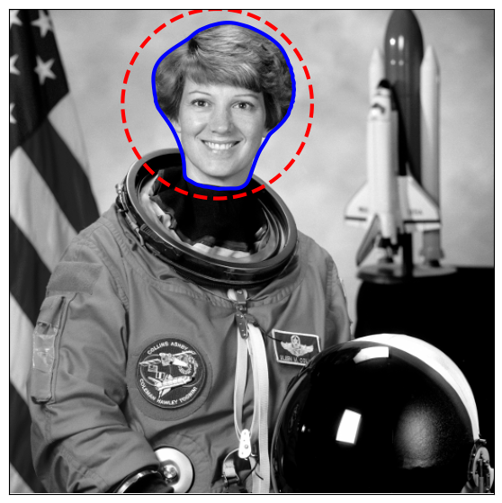
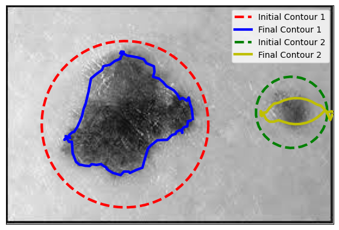
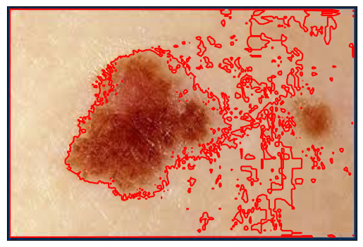
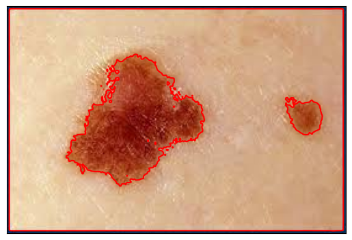

# Advanced Image Segmentation with Active Contour Models

This project demonstrates multiple methods for **Active Contour Image Segmentation**. Below are visual examples for each method.

---

## 1. Performing Active Contour on Astronaut Image

The **Active Contour Model** is applied to an astronaut's image to segment the head region.

**Result:**

---

## 2. Multi-Contour Segmentation

Two initial contours (dashed lines) evolve into their respective final boundaries.

**Result:**

---

## 3. Chan-Vese Active Contour Segmentation

The **Chan-Vese model** segments objects based on their intensity differences.

### Result 1: Initial Contours vs Final Contours

### Result 2: Improved Contour Evolution

---

## Summary

This repository showcases:

- Single vs multi-contour segmentation.
- Chan-Vese Active Contour for region-based segmentation.
- Comparisons with gradient-based methods like Sobel filters.

---

## License

This project is licensed under the MIT License.
